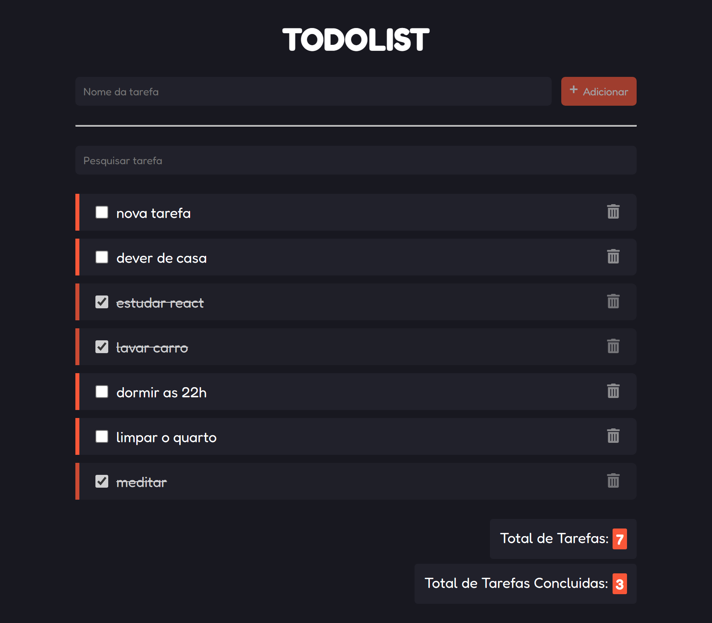

<h1 align="center">
    Todo List
</h1>



## Projeto

Essa é uma lista de tarefas feita com a lib [ReactJS](https://pt-br.reactjs.org/), contendo as seguintes funcionalidades: 

- [x] Adicionar nova tarefa
- [x] Remover tarefa
- [x] Pesquisar tarefa
- [x] Marcar a terefa como concluida
- [x] Contador de tarefas criadas
- [x] Contador de tarefas concluidas

## Como executar

Será necessario fazer o clone do projeto

```bash
$ git clone https://github.com/estaeldev/react-todolist-rasmoo-curso.git
```
Instalar as dependências e executar o script de inicialização

```bash
$ npm i

$ npm run dev
```


